# REDMI Book Pro 16 2025 → Ubuntu 26.04

[English version](INSTALL.md)

这是一条**推荐安装路线**：把 REDMI Book Pro 16 2025 安装成 Ubuntu 26.04 的 Linux 开发 / CI 节点。

如果实际界面和这里明显不一样，**先停下来，拍照，然后视频/微信确认**。尤其不要在不确定时乱改 BIOS/UEFI 或磁盘设置。

## 需要准备

- REDMI Book 和电源；
- 一个 **16 GB 或更大的 U 盘**，用来安装 Ubuntu；
- 如果想保留出厂 Windows 恢复盘，再准备一个 **32 GB 或更大的 U 盘**；
- 网络；
- 和远程操作方保持视频/语音通话。

直接用新 REDMI Book 自带的 Windows 制作两个 U 盘。不需要使用工作 ThinkPad；iPad 只用于视频通话。

## 0. 删除 Windows 之前

第一次先进入 Windows，确认：

- 屏幕、键盘、触控板、Wi-Fi 正常；
- Windows 显示大约 **32 GB 内存**；
- 内置 SSD 大约 **1 TB**；
- 充电正常。

### 可选：制作 Windows 恢复 U 盘

1. 插入 32 GB U 盘。
2. 打开开始菜单，搜索 **Recovery Drive / 恢复驱动器**。
3. 打开以后，保留 **Back up system files to the recovery drive / 将系统文件备份到恢复驱动器** 的勾选。
4. 选择这个 32 GB U 盘，点 **Create / 创建**。
5. 完成后标记为 `REDMI Windows recovery`，拔出并收好。

如果 **Settings → Privacy & security → Device encryption / 设置 → 隐私和安全性 → 设备加密** 已开启，保存恢复密钥；如果显示关闭，直接继续。

微软说明：https://support.microsoft.com/en-US/Windows/Experience/backup-recovery/recovery-drive

### 可选：先领取预装 Office

部分中国大陆版本会附带 Office 家庭和学生版。如果 Windows 里显示有随机器附送的 Office，而且以后可能会用，建议**在删除 Windows 之前**先绑定/激活到准备长期使用的 Microsoft 账号。

## 1. 下载 Ubuntu 26.04 LTS

只用 Ubuntu 官方网站：

https://ubuntu.com/download/desktop

选择：

**Ubuntu 26.04 LTS — Intel or AMD 64-bit**

下载文件名应该类似：

```text
ubuntu-26.04-desktop-amd64.iso
```

Ubuntu 官方完整安装说明：

https://ubuntu.com/desktop/docs/en/26.04/tutorial/install-ubuntu-desktop/

## 2. 在 Windows 上制作 U 盘

Rufus 官方网站：

https://rufus.ie/

Ubuntu 官方 Rufus 说明：

https://ubuntu.com/desktop/docs/en/26.04/how-to/create-a-bootable-usb-stick/#using-rufus

1. 拔掉 Windows 恢复 U 盘，再插入 16 GB Ubuntu U 盘。
2. 打开 Rufus，在 **Device / 设备** 中选择 Ubuntu U 盘。

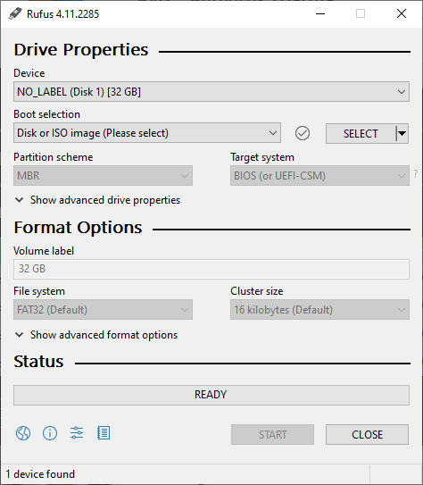

3. 点 **SELECT / 选择**，选择 `ubuntu-26.04-desktop-amd64.iso`。
4. 常规选项保持默认。如果高级格式选项里出现 **Enable runtime UEFI media validation**，不要勾选。

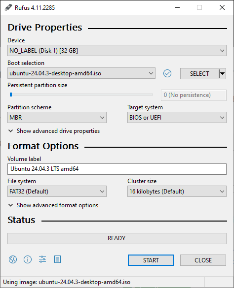

5. 点 **START / 开始**。
6. 如果提示 ISOHybrid，选择 **Write in ISO Image mode**，再点 **OK**。

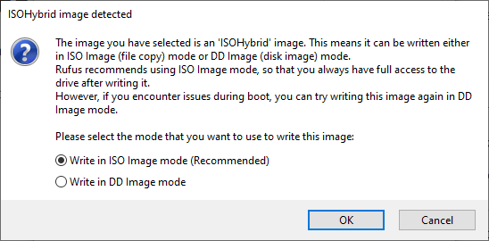

7. 出现清空 U 盘的确认窗口时，点 **OK**。

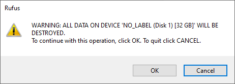

8. 等状态显示 **READY**，然后关闭 Rufus。

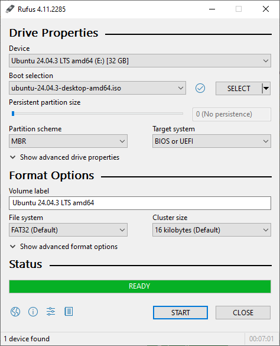

> Ubuntu 当前 26.04 文档里的 Rufus 截图还显示旧的 24.04 文件名。实际下载的文件应该写 **26.04**。

## 3. 从 U 盘启动 REDMI Book

1. 电脑完全关机。
2. 插入 Ubuntu U 盘。
3. 开机后连续按 **F12**，进入一次性启动菜单。
4. 选择 USB / U 盘启动。

如果 F12 被当成功能快捷键，可以试 **Fn+F12**。

**第一次先保持 Secure Boot 开启。** Ubuntu 官方安装镜像可以在 Secure Boot 开启的情况下启动。

如果启动菜单里完全看不到 U 盘，先停下来确认，不要随便改固件设置。

## 4. 先试用 Ubuntu，再删除任何东西

按语言、键盘、网络走到下面这个界面：

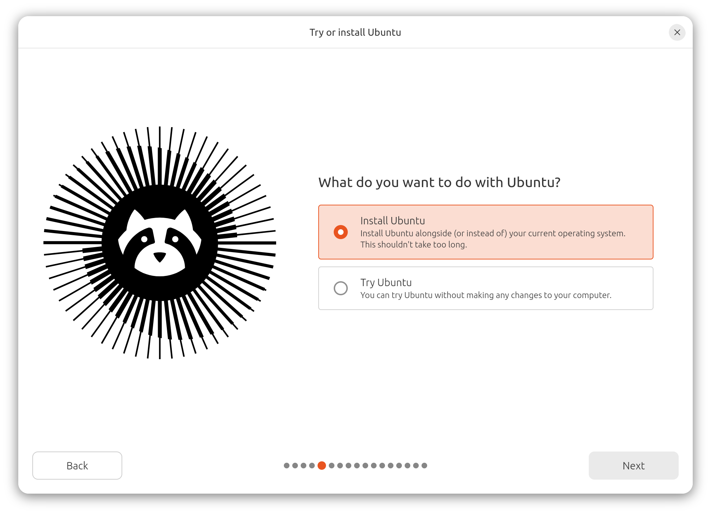

先选 **Try Ubuntu / 试用 Ubuntu**。

简单检查：

- 屏幕显示正常；
- 键盘和触控板正常；
- Wi-Fi 能连接；
- 扬声器正常；
- 没有异常卡死或重启。

确认以后，从桌面打开 **Install Ubuntu**。

## 5. 安装选项

使用普通的交互式安装。

选择 **Default selection**：

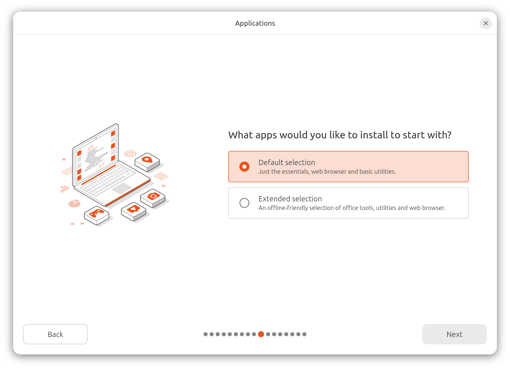

如果安装程序询问第三方驱动/媒体格式支持，保留推荐选项即可。

## 6. 磁盘设置 —— 这里会真正删除 Windows

选择：

**Erase disk and install Ubuntu / 清除磁盘并安装 Ubuntu**

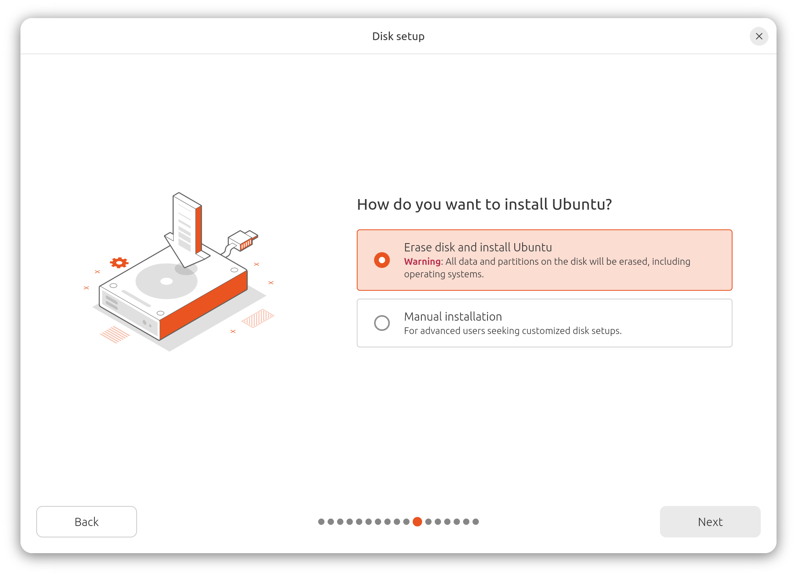

继续之前，确认目标是电脑内部的 **约 1 TB SSD**。

这台机器准备长期作为无人值守节点。第一次安装建议**不启用全盘加密**，这样断电重启后不会卡在必须现场输入磁盘密码的界面。

### 如果看不到内部 SSD，马上停

如果安装程序找不到约 1 TB 的内部 SSD，**先停下来确认**。部分 Intel 电脑可能涉及 RST/VMD/存储控制器设置，不要靠猜去改。

Ubuntu 参考：

https://ubuntu.com/desktop/docs/en/26.04/reference/intel-rst-during-ubuntu-installation/

## 7. 创建本地账号

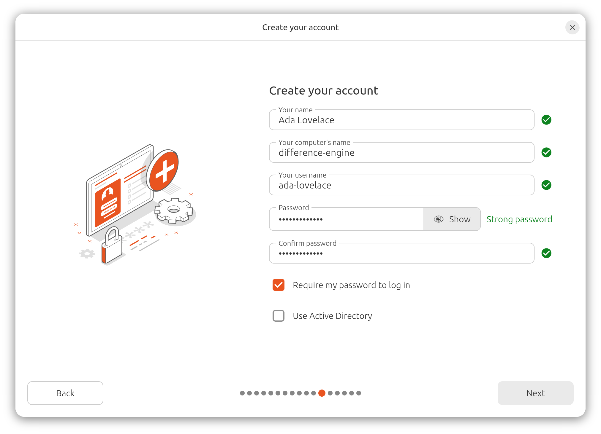

建议电脑名：

```text
redmi-01
```

Ubuntu 用户名使用：

```text
leo
```

创建普通管理员账号和本地密码，保留 **Require my password to log in**。

把 **用户名** 发给远程操作方。

## 8. 最后检查

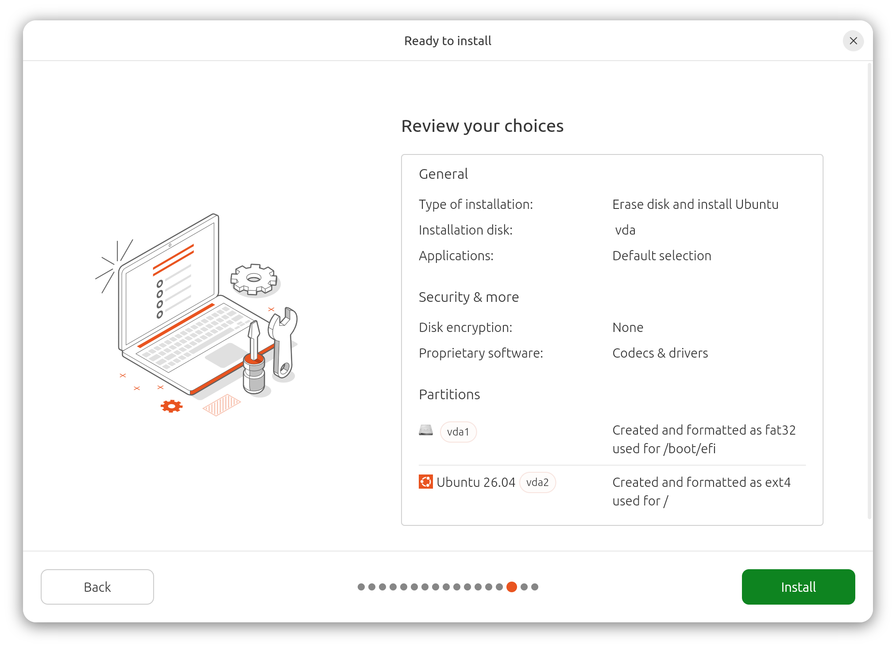

重点确认：

- **Erase disk and install Ubuntu**；
- **Default selection**；
- **Disk encryption: None**；
- 根文件系统是 **ext4**；
- 安装目标是内部 SSD。

确认以后点 **Install**。

## 9. 安装完成并重启

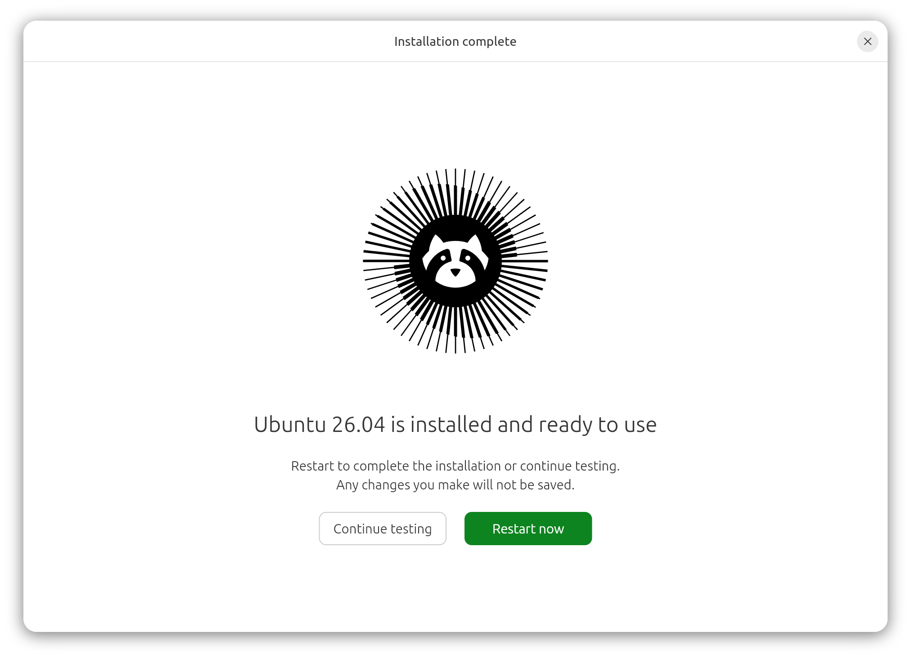

点 **Restart now**。提示拔 U 盘时拔掉 U 盘，然后按 Enter。

进入 Ubuntu 桌面并连接网络。

## 10. 把机器交给远程操作方

推荐使用 **Tailscale SSH**。这样不用改路由器、不用开放公网 22 端口、不用配置动态 DNS，也不用现场复制 SSH 公钥。

按 **Ctrl + Alt + T** 打开 Terminal / 终端。

### 10a. 安装普通 SSH 和 Tailscale

点击下面代码框右上角的 GitHub 复制按钮，把**整个代码框**复制进 Terminal，然后按 Enter：

```bash
sudo apt update
sudo apt install -y openssh-server curl
sudo systemctl enable --now ssh
curl -fsSL https://tailscale.com/install.sh | sh
```

可能会要求输入 Ubuntu 本地密码。Terminal 里输入密码时屏幕不会显示字符，正常输入然后按 Enter 即可。

如果 Tailscale 下载/安装失败，**先停下来联系远程操作方**。普通 OpenSSH 已经装好了，所以还有备用方案。

### 10b. 加入远程操作方的 Tailscale 网络，并启用 Tailscale SSH

复制并运行：

```bash
sudo tailscale up --ssh --hostname=redmi-01
```

命令会显示一个以 `https://login.tailscale.com/...` 开头的网址。

把这个网址发给远程操作方。现场的人不需要知道远程操作方的 Tailscale 密码，也不需要登录对方账号。

远程操作方在自己的电脑/手机上打开这个网址，把 REDMI Book 加入自己的 Tailscale 网络。

对方确认成功以后，复制并运行：

```bash
tailscale status
printf '\nUbuntu username: '; whoami
printf 'Computer name: '; hostname
printf 'Tailscale IP: '; tailscale ip -4
```

把输出发给远程操作方。

### 10c. 远程操作方测试

远程操作方自己的电脑也登录同一个 Tailscale 网络以后，可以测试：

```bash
ssh leo@redmi-01
```

使用 Tailscale SSH 时，这条连接**不需要另外生成和复制 SSH 公钥/私钥**；Tailscale 负责这条 tailnet 内 SSH 连接的身份认证和授权。

从远程操作方**实际所在的网络**成功登录以后，现场必须完成的工作就结束了。拿着电脑的人可以停下，远程操作方继续执行[接手后的 TODO](../../docs/REDMI_HANDOFF_TODO.md)。

> 中国大陆到境外的网络路由可能让 Tailscale 比其他地区更慢或者偶尔不稳定，所以同时安装普通 OpenSSH，把 Tailscale 当成首选远程路径，而不是唯一的恢复路径。机器长期无人值守以前，一定要实际测试远程连接。

## 遇到这些情况就停下来确认

- 启动菜单看不到 Ubuntu U 盘；
- 安装程序看不到约 1 TB 的内部 SSD；
- 安装程序准备清除一个看起来不对的磁盘；
- BIOS/UEFI 要求输入不知道的密码；
- Ubuntu 试用环境反复死机/重启；
- 安装后无法正常启动；
- Tailscale 无法安装或无法显示登录网址；
- 任何看起来有风险、又不确定是什么意思的界面。

**拍照比猜更有用。**

## 这款机器的 Linux 支持

当前 ArchWiki 对 REDMI Book Pro 16 2025 的记录显示：GPU、Wi-Fi、蓝牙、摄像头、触控板、键盘、TPM、指纹、音频和环境光传感器都可用；另外还记录了 Linux 下的充电上限控制和 `fwupd` 支持：

https://wiki.archlinux.org/title/Xiaomi_RedmiBook_Pro_16_2025
